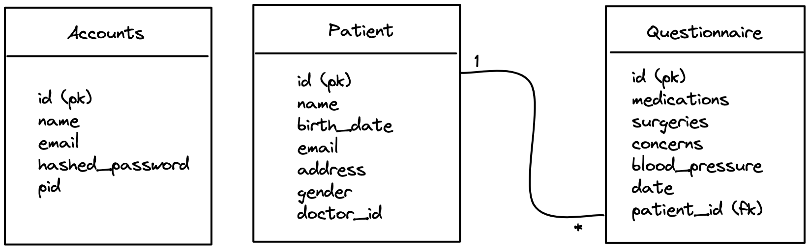

# Data Models

### Patient Microservice

## Patient

| name             | type   | unique | optional |
| ---------------- | ------ | ------ | -------- |
| name             | string | no     | no       |
| birth_date       | date   | no     | no       |
| email            | string | no     | no       |
| address          | string | no     | no       |
| gender           | string | no     | no       |
| doctor_id        | int    | no     | no       |

The 'patient' entity contains data about a specific patient that belongs to an 'account'(doctor)

## Questionnaire

| name             | type                        | unique | optional |
| ---------------- | --------------------------- | ------ | -------- |
| medications      | string                      | no     | yes      |
| surgeries        | string                      | no     | yes      |
| concerns         | string                      | no     | yes      |
| weight           | int                         | no     | yes      |
| blood_pressure   | string                      | no     | yes      |
| date             | date                        | no     | yes      |
| patient_id       | reference to Patient entity | no     | no       |

The 'questionnaire' contains data about a specific questionnaire that belongs to a 'patient' entity

### Accounts Microservice

## Account

| name             | type   | unique | optional |
| ---------------- | ------ | ------ | -------- |
| name             | string | no     | no       |
| email            | string | yes    | no       |
| hashed_password  | string | no     | no       |
| pid              | int    | yes    | no       |

The 'Account' entity contains data about a specific doctor that allows them to log in and view their patients

