# Customer Graphical Human Interface

## Landing Page
Initial page a user sees when the application starts. User has two options:
   * 'Register' - redirects to register form if they do not have an account in the database.
   * 'Login' - redirects to the homepage if the email and password matches in the database.
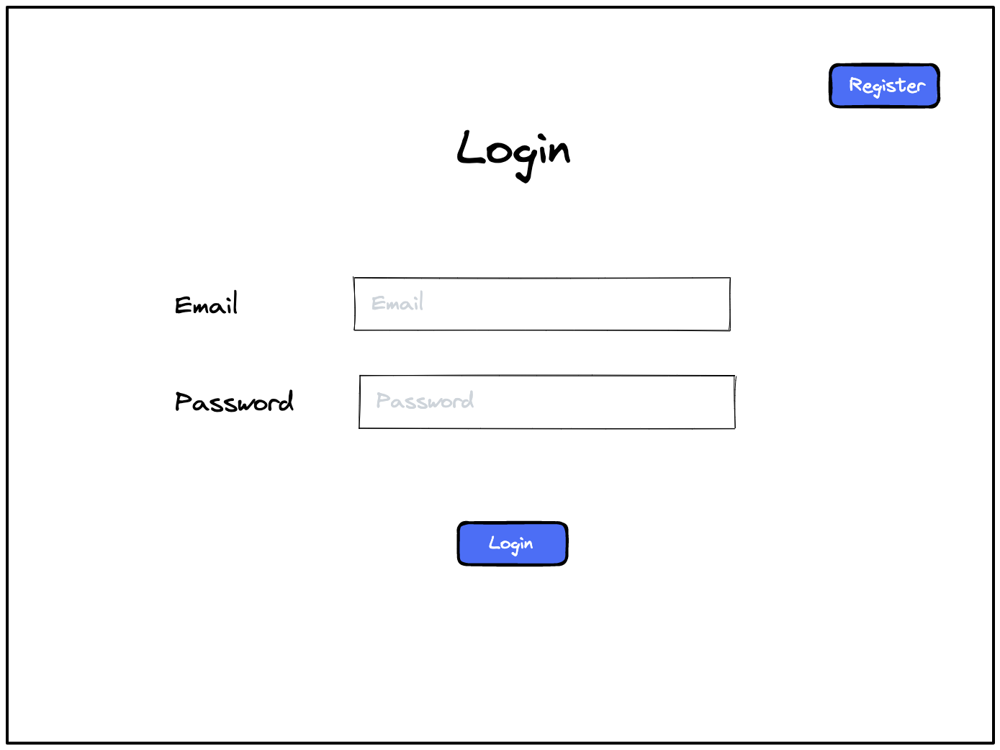

## Register
Form for the user to create an account that is saved into the database. When successful, the user will be redirected to the landing page to log in.
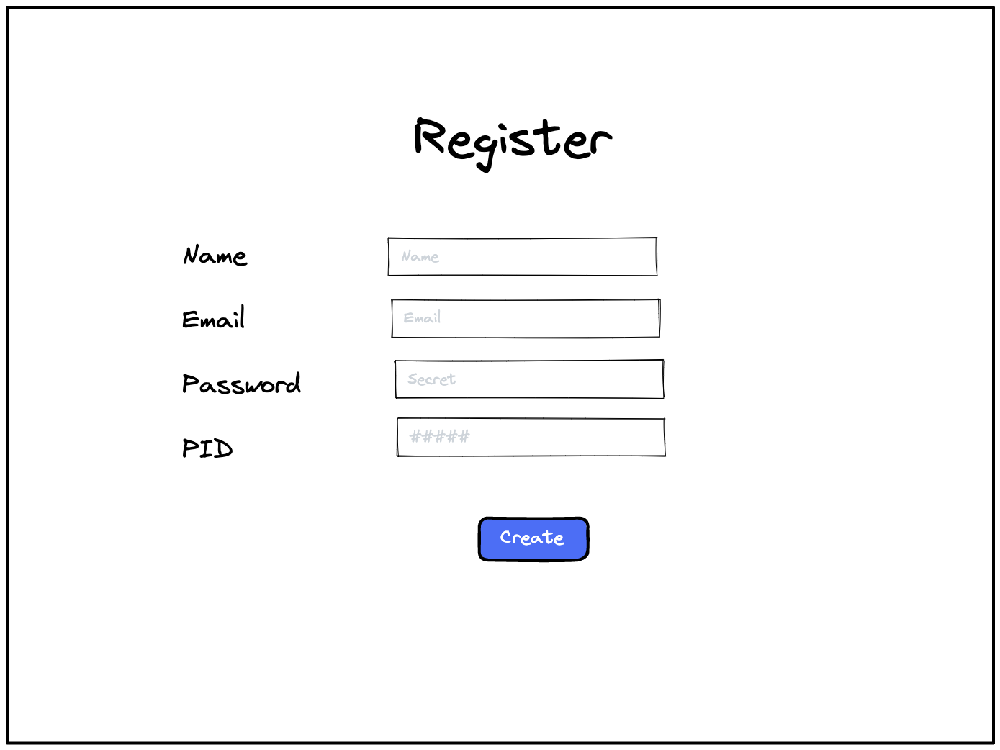

## Home Page
This is the first page a user sees when logged in.
From the navigation bar, the user has 4 options:
   * 'Home' - the page will not redirect.
   * 'Patients' - redirects to a list view of patients.
   * 'Create Patient' - redirects to a form that inputs a new patient.
   * 'Logout' - redirects to a page for log out verification.
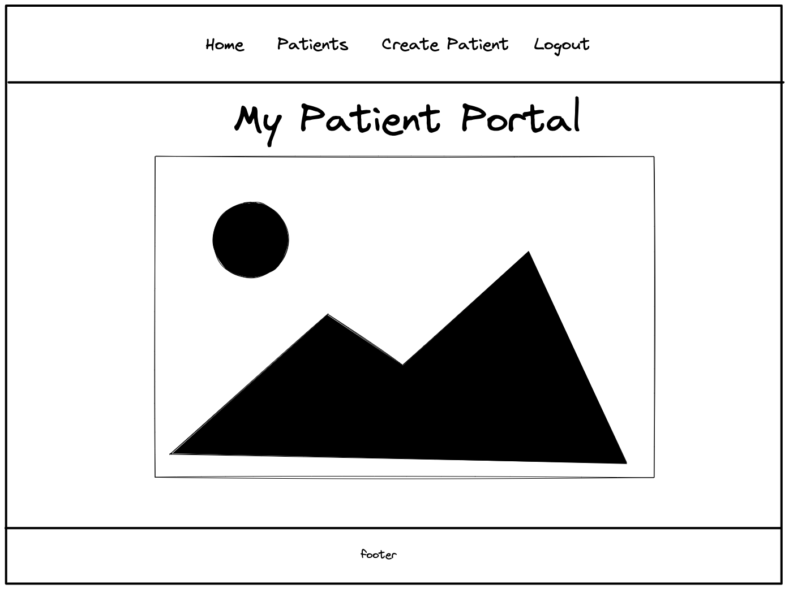

## Patient List
A list view of all patients that belong to the user.
The user can click on an individual patient id to view additional details or click on the create button to add a new patient to the database.
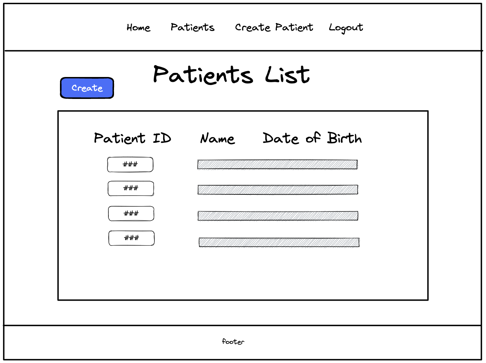

## Create Patient
Form to enter a patient into the database. Date of birth and gender have drop down menus to aide inputs. If successful, the user will be redirected to a detail view of the patient.

## Patient Detail
Detail view of a patient that includes their name, patient id, date of birth, email, address, and gender. The user has three options:
   * 'All Patients' - redirects to a list view of patients.
   * 'Edit Patient' - redirects to a form to edit patient details.
   * 'Patient Questionnaires' - redirects to a list view of questionnaires of the patient.
   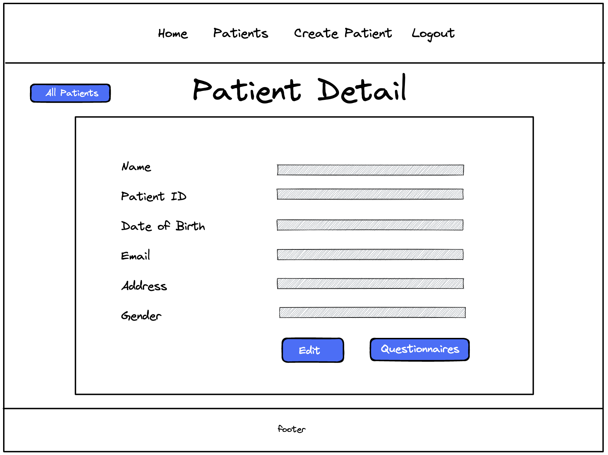

## Update Patient
Form to update a patients' details. The form is prefilled with their current data. If successful, the user will be redirected to a detail view of the patient with updated information.
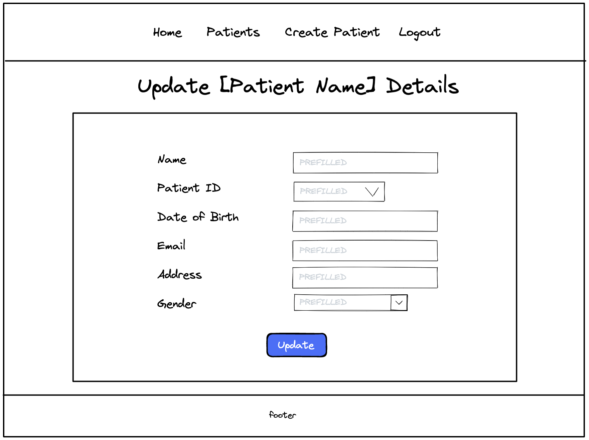

## Questionnaire List
List view of all questionnaires that belong to the patient.
The user can click on a specific questionnaire date to view the details of the questionnaire.
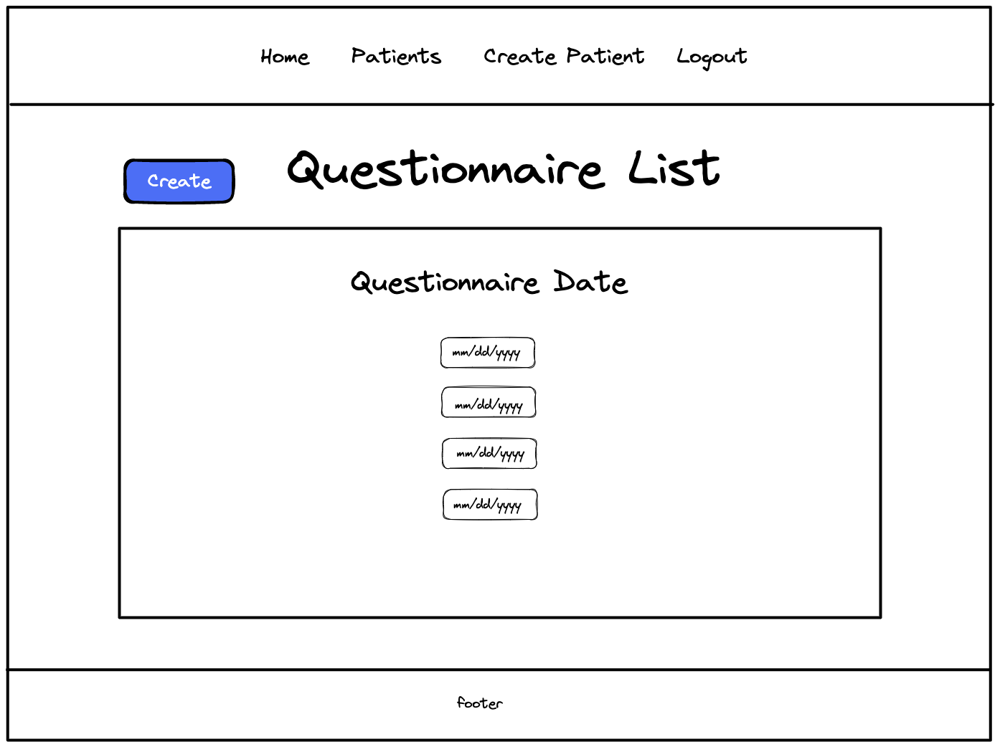

## Create Questionnaire
Form to enter a questionnaire into the database for that specific patient. Date is a drowdown menu and weight can be incremented with the arrows. If successful, the user will be redirected to the detail view of the questionnaire.
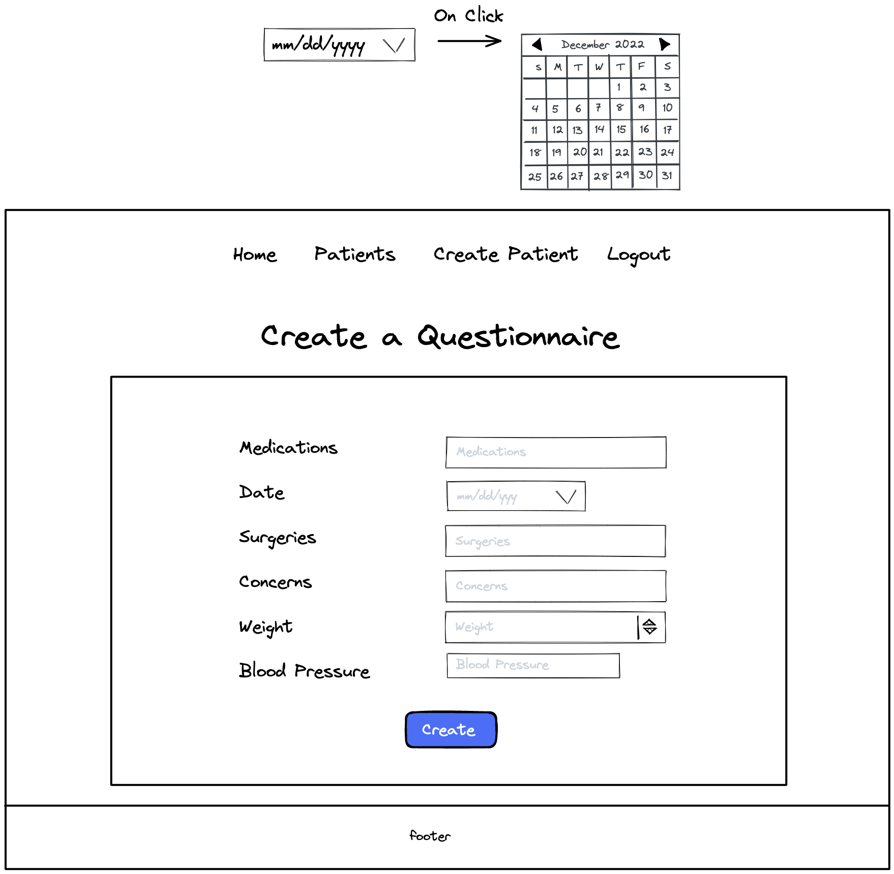

## Questionnaire Detail
Detail view of the questionnaire that includes the medications, date, surgeries, concerns, weight, and blood pressure. The user has three options:
   * 'Edit' - redirects to a form to edit the questionnaire.
   * 'Delete' - redirects to the list view of questionnaires and deletes the questionnaire from the database.
   * 'Go Back' - redirects to the list view of questionnaires.
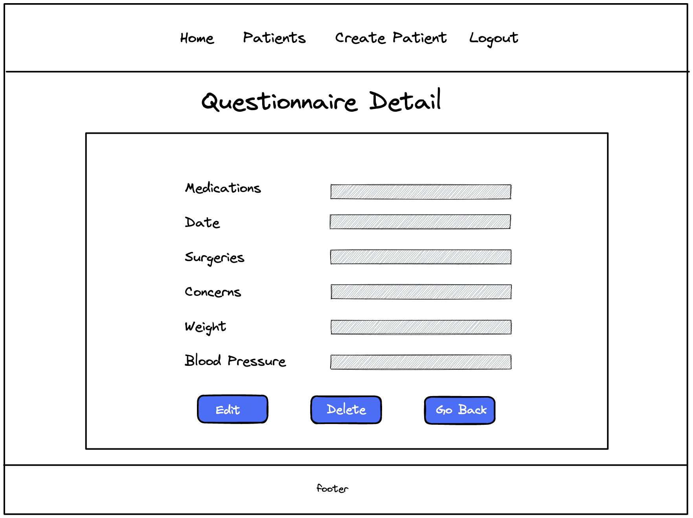

## Update Questionnaire
Form to update a questionnaires' details. The form is prefilled with their current data. If successful, the user will be redirected to a detail view of the questionnaire with updated information.
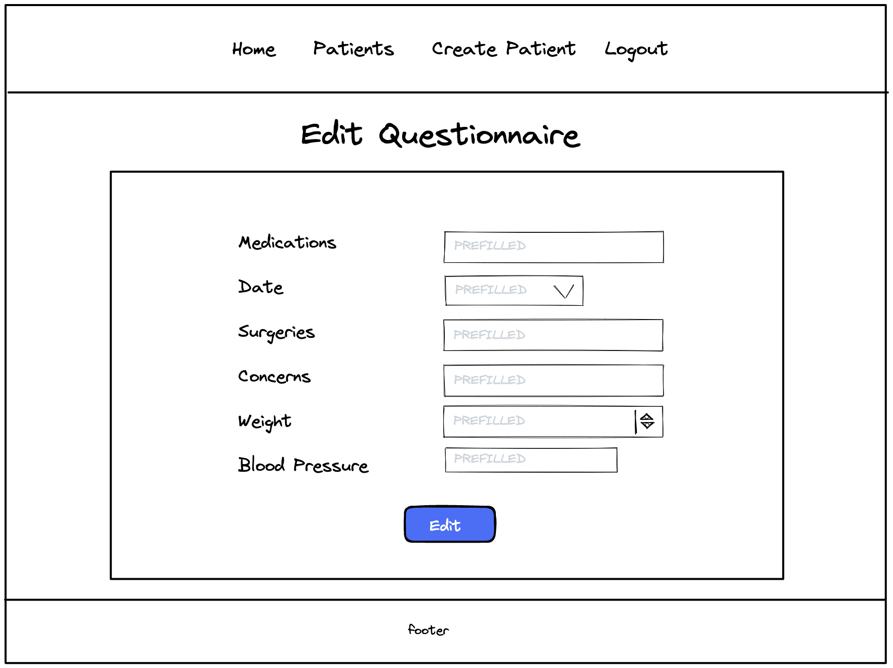

## Logout Verification
Page that asks the user to verify they want to log out. If yes, the user will be redirected to the landing page.
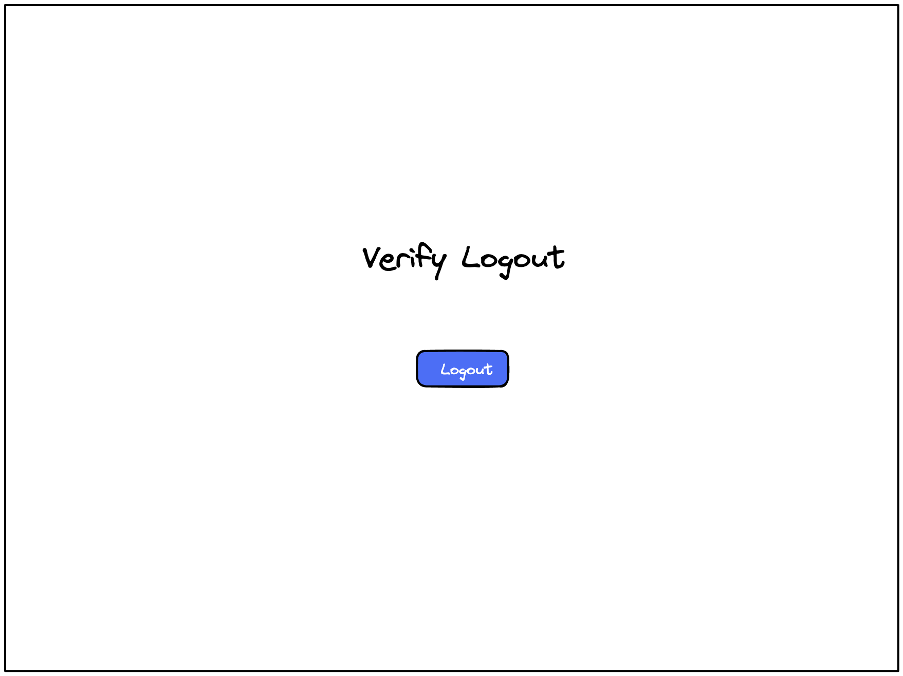
