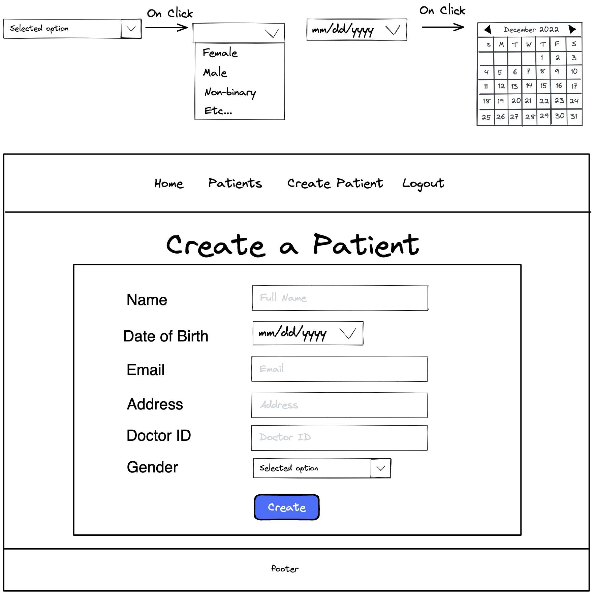

# Customer Graphical Human Interface

## Landing Page
Initial page a user sees when the application starts. User has the option to log in or register if they do not have an account in the database.

## Home Page
This is the first page a user sees when logged in.
From the navigation bar, the user has 4 options:
   * 'Home' - When clicked, the page will not redirect.
   * 'Patients' - When clicked, the page will redirect to a list view of patients.
   * 'Create Patient' - When clicked, the page will redirect to a form that inputs a new patient.
   * 'Logout' - When clicked, the page will redirect to a page for log out verification.

## Patient List
A list view of all patients that belong to the user.
The user can click on an individual patient id to view additional details.
The user can click on the create button to add a new patient.

## Create Patient
Form to enter a patient into the database. Date of birth and gender have drop down menus to aide inputs.

## Questionnaire List

## Create Questionnaire
